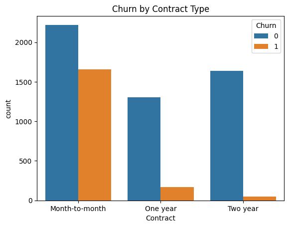
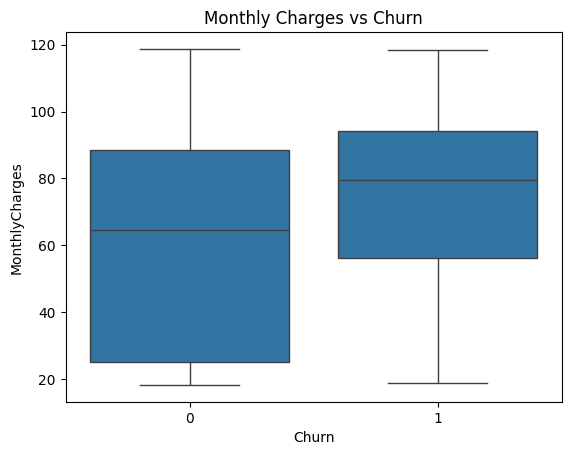
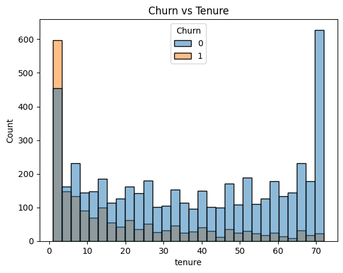
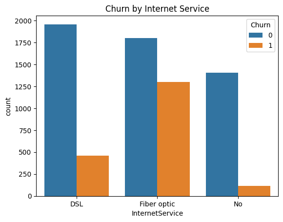
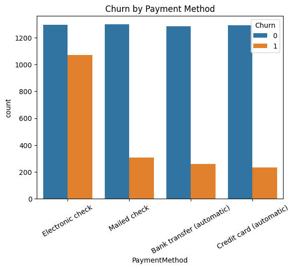

# FUTURE_DS_02

## Task 2: Customer Retention & Churn Analysis
# Customer Churn Analysis

## 📌 Project Overview
This project analyzes customer churn behavior using a telecom dataset. The goal is to identify key factors influencing churn and provide insights to improve customer retention.

---

## 📊 Dataset
- 7043 customer records
- 21 features including demographics, services, and billing
- Target variable: Churn

---

## 🔧 Tools Used
- Python
- Pandas
- Seaborn
- Matplotlib

---

## 📈 Key Insights
- Month-to-month customers have the highest churn
- Customers with higher monthly charges churn more
- New customers (low tenure) churn more
- Fiber optic and electronic check users show higher churn

---

## 💡 Business Recommendations
- Encourage long-term contracts
- Improve pricing strategies
- Enhance onboarding for new customers
- Optimize payment methods

---

## 📷 Visualizations

### Contract vs Churn

### Monthly Charges vs Churn

### Tenure vs Churn

### Internet Service

### Payment Method

---

## 📁 Files Included
- Jupyter Notebook (.ipynb)
- PPT Presentation
- PDF Report
- Graph Images

---

## 🚀 Conclusion
This project demonstrates how data analysis can help businesses reduce churn and improve retention.
